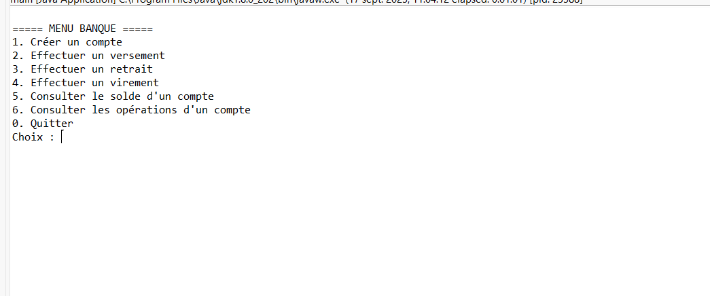

# Gestion de Système Bancaire - Application Console Java

## Description du projet
Cette application console en Java permet de gérer des comptes bancaires (courant et épargne) ainsi que leurs opérations (versements, retraits, virements).  
Le projet est réalisé dans un contexte pédagogique pour appliquer les concepts de Java orienté objet, la gestion des exceptions, les collections, et une architecture en couches.

### Fonctionnalités principales
- Création de comptes courants et épargne
- Versement et retrait d’argent
- Virement entre comptes
- Consultation du solde
- Consultation de l’historique des opérations
- Annulation d’opérations en cours
- Menu interactif en console

---

## Structure du projet
Structure du dossier
Le numéro de série du volume est 2E44-EAC5
C:.
│   .classpath
│   .project
│   README.md
│
├───.settings
│       org.eclipse.core.resources.prefs
│       org.eclipse.jdt.core.prefs
│
├───bin
│   ├───entities
│   │       Compte.class
│   │       CompteCourant.class
│   │       CompteEpargne.class
│   │       Operation.class
│   │       Retrait.class
│   │       Versement.class
│   │
│   ├───presentation
│   │       Main.class
│   │
│   ├───repository
│   │       CompteRepository.class
│   │
│   ├───service
│   │       CompteService.class
│   │       OperationService.class
│   │
│   ├───UML
│   │       ATM-diagramme-class.drawio (1).png
│   │
│   └───utilitaire
│           Validation.class
│
└───src
    ├───entities
    │       Compte.java
    │       CompteCourant.java
    │       CompteEpargne.java
    │       Operation.java
    │       Retrait.java
    │       Versement.java
    │
    ├───presentation
    │       Main.java
    │
    ├───repository
    │       CompteRepository.java
    │
    ├───service
    │       CompteService.java
    │       OperationService.java
    │
    ├───UML
    │       ATM-diagramme-class.drawio (1).png
    │
    └───utilitaire
            Validation.java


---

## Technologies utilisées
- Java 8 (JDK 1.8)
- Collections Java (`ArrayList`, `HashMap`)
- Java Time API (`LocalDateTime`)
- UUID pour générer des identifiants uniques
- Eclipse IDE
- Git pour le contrôle de version

---

## Prérequis
- JDK 1.8 installé
- Eclipse IDE ou tout IDE compatible Java
- Git pour cloner le projet (optionnel)

---

## Installation et exécution

1. Cloner le projet depuis GitHub :
```bash
git clone https://github.com/safiaKhoulaid/gestionne-de-syst-me-bancaire.git
```
---
## Menu principale 


### Création d’un compte


### Solde du compte

---

